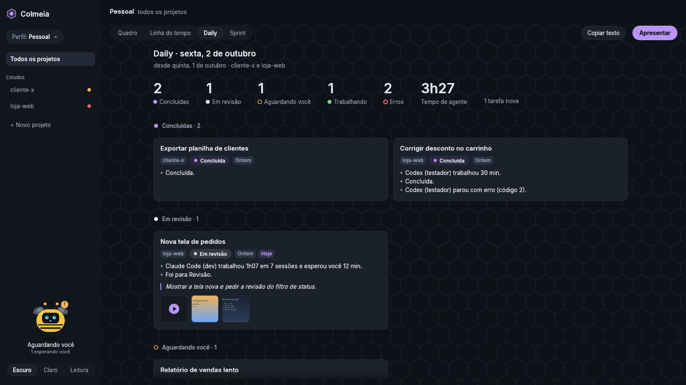

# Colmeia

Um app desktop para coordenar vários agentes de IA de código (Claude Code, Codex e outros) em projetos e branches isolados, com um quadro de tarefas, uma abelha que avisa quando algo precisa de você e o registro do trabalho pronto para a daily e a sprint.


> **Estado atual (0.2.0):** perfis, contas de IA, workspaces, projetos (repositórios git ou pastas de trabalho sem git), tarefas e agentes de verdade. Cada tarefa abre o Claude Code, o Codex, outra ferramenta ou um terminal comum na pasta dela (ou numa cópia isolada do repositório), e retoma conversas do Claude Code começadas em outro lugar. O quadro se atualiza sozinho quando um agente trabalha, espera você ou para; a linha do tempo, a daily e a sprint mostram o trabalho por tarefa, e o modo apresentação passa a daily inteira em tela cheia, com notas, fotos e vídeos. Pela daily dá para pedir algo a mais ao agente de uma tarefa, que responde na nota e anexa prints do navegador da tarefa, e o painel da tarefa mostra os arquivos da pasta. Roda no Linux; o Windows ainda não (veja [Plataformas](#plataformas)).

## Por que existe

Quem trabalha com vários agentes vira o gargalo: copia contexto de um terminal para outro, perde o controle do que cada um está fazendo e mistura ambientes. A Colmeia junta, num lugar só:

- **Isolamento por branch:** cada tarefa pode trabalhar numa cópia isolada do repositório (git worktree), na branch dela.
- **Tudo num lugar só:** pastas de trabalho sem git (análises, clientes, anotações) entram como projeto, sem branches.
- **Quadro de tarefas por projeto**, estilo Jira, com a branch como filtro e cartões que andam sozinhos entre "trabalhando" e "aguardando você".
- **Terminais dos agentes** no painel da tarefa: o que está em foco em tempo real, os outros como miniaturas.
- **A abelha**, que resume o que mais precisa de você (erro, aprovação pendente, trabalho em andamento) e comemora quando uma tarefa termina.
- **Perfis separados**, cada um com projetos, contas de IA e tema próprios.
- **Registro do trabalho** dia a dia, com a daily e a sprint prontas para copiar.

É um projeto pessoal, de código aberto e gratuito, feito para ajudar colegas e qualquer dev. Não é projeto de nenhuma empresa nem tem vínculo com uma.

## Instalar (Linux)

Cada versão publicada tem os binários prontos para Linux x86_64 na página de releases do GitHub (`colmeia-linux-x86_64.tar.gz`, com o `SHA256SUMS` ao lado):

```bash
sha256sum -c SHA256SUMS
mkdir colmeia && tar -xzf colmeia-linux-x86_64.tar.gz -C colmeia
./colmeia/instalar.sh   # ~/.local/bin, atalho e ícone; sem sudo
```

## Como rodar a partir do código (Linux)

Requisitos: Go 1.26+, Rust 1.88+ e as bibliotecas de sistema que o `eframe` usa (no Ubuntu, `libxkbcommon-dev`, `libgtk-3-dev` e os drivers de vídeo).

```bash
# 1. Núcleo
go -C nucleo build -o ../bin/colmeia-nucleo ./cmd/colmeia-nucleo

# 2. Tela (inicia o núcleo sozinha se ele não estiver rodando)
COLMEIA_NUCLEO=$PWD/bin/colmeia-nucleo cargo run --release -p colmeia

# Modo demonstração: cargas de teste nos terminais e cenários para a abelha
COLMEIA_DEMO=1 COLMEIA_NUCLEO=$PWD/bin/colmeia-nucleo cargo run --release -p colmeia

# Vitrine do mascote
cargo run --release -p mascote --example vitrine

# Instalar o que foi compilado (~/.local/bin, atalho e ícone)
./scripts/instalar.sh
```

O núcleo continua rodando depois que a tela fecha, porque é dono dos terminais: **fechar a janela não para os agentes**, que seguem trabalhando (e usando a conta de IA). Ao fechar com agentes rodando, a Colmeia pergunta se é para fechar só a janela ou parar todos. Para encerrar o núcleo (e os agentes, que têm uns segundos para salvar a conversa): `colmeia-nucleo --encerrar`.

## Primeiro uso

1. **Criar perfil:** nome (Profissional, Estudo, Pessoal…) e tema (escuro, claro ou leitura).
2. **Contas de IA:** a Colmeia mostra as ferramentas instaladas (Claude Code, Codex, Gemini CLI, OpenCode). Cada uma pode usar a conta do sistema ou uma conta só daquele perfil; nesse caso o login fica separado e é feito na primeira vez que o agente abrir.
3. **Primeiro projeto:** um repositório git ou qualquer pasta de trabalho. Adicionar não altera nada na pasta.

Depois disso: o perfil se troca pelo seletor no topo da barra lateral; "+ Novo projeto" adiciona outras pastas; "+ Nova tarefa" cria tarefas no Backlog; arrastar move entre colunas; o "⋯" (ao passar o mouse) ou o botão direito no cartão, no projeto e no agente mostram as outras ações.

## Agentes

- **Onde trabalham.** Numa tarefa de repositório git você escolhe entre uma **cópia isolada** (um git worktree numa branch nova ou existente, em `~/.local/share/colmeia/copias/`) e **direto na pasta** do projeto. Numa pasta sem git, direto na pasta.
- **Adicionar agente** abre a ferramenta escolhida no painel da tarefa, com a conta de IA do perfil: a do sistema, ou a conta só daquele perfil (`CLAUDE_CONFIG_DIR` e `CODEX_HOME` apontam para uma pasta do perfil).
- **Retomar conversa do Claude Code.** A Colmeia lista as conversas que o Claude Code guardou para a pasta da tarefa (com o título e a data) e abre a escolhida com `claude --resume`. Assim dá para continuar na Colmeia uma conversa começada no IntelliJ ou num terminal. Se o Claude Code estiver aberto na mesma pasta fora da Colmeia, ela avisa para fechar lá antes, porque as duas se atropelariam.
- **Um agente parado** (o programa terminou ou o núcleo foi reiniciado) mostra o que ficou na tela e o botão para iniciar de novo. Um agente do Claude Code volta na mesma conversa, porque cada um nasce com um id de conversa próprio.
- **Abrir no IntelliJ** (ou no VS Code) e **Abrir pasta** ficam no topo do painel da tarefa; `COLMEIA_EDITOR=comando` escolhe outro editor.
- **Teclado completo no terminal** depois de clicar nele: Ctrl+C e as outras combinações com Ctrl, setas com modificadores, Home/End, PgUp/PgDn, Delete, F1–F12, Alt+tecla, Shift+Tab e Shift+Enter (quebra a linha no Claude Code). Shift+PgUp/PgDn rolam o histórico, e Ctrl+V com uma imagem copiada repassa a colagem para o Claude Code ler a imagem.

Na caixa de mensagem do painel da tarefa, **Enter quebra a linha**, **Ctrl+Enter envia** e **Ctrl+V cola imagens**: o núcleo guarda a imagem (em `~/.local/share/colmeia/anexos/`, anexada à tarefa) e o caminho vai junto na mensagem, que é como o Claude Code e o Codex recebem imagens.

**↑ traz as mensagens anteriores**, como no terminal: com o cursor na primeira linha, a seta para cima mostra o que você já mandou ao agente em foco (e continua andando em qualquer linha), a seta para baixo volta, e depois da mais nova (ou com Esc) volta o rascunho que você estava escrevendo. O histórico fica no núcleo, então sobrevive a fechar a Colmeia, com até 200 mensagens por agente.

> **Privacidade do histórico.** O núcleo não guarda uma mensagem que pareça ter senha, token ou chave (`sk-…`, `ghp_…`, `senha: …`, chave privada) e avisa no rodapé da caixa; a mensagem é enviada mesmo assim. O filtro é uma leitura, não uma garantia: se um segredo escapar, "Limpar histórico de mensagens" no menu "⋯" do agente apaga tudo. O histórico fica fora do registro imutável de eventos justamente para poder ser apagado ([decisão 0006](docs/decisoes/0006-apresentacao-e-historico.md)).

## Em tempo real

O núcleo avisa a tela na hora quando algo muda, por evento (nada de consulta periódica). Cada agente aparece com um estado, com a mesma cor e o mesmo texto no cartão, no painel, na abelha e na linha do tempo:

| Estado | Como aparece |
| --- | --- |
| Trabalhando | ponto verde e a última linha do terminal |
| Pede aprovação | "Parece pedir aprovação · desde 14:32" |
| Sua vez | "Sua vez · desde 14:32" (terminou a resposta e espera você) |
| Parado | "Parado desde 14:10" (terminal comum quieto) |
| Terminou / interrompido | "Terminou às 14:40" / "Interrompido às 14:40" |
| Erro | "Parou com erro (código 1) às 14:40" e a faixa vermelha no cartão |

- **"Aguardando você" é uma leitura, não uma certeza.** O núcleo olha a saída do terminal: depois de 5 segundos sem saída, uma ferramenta de IA (que escreve sem parar enquanto pensa) parece ter terminado a vez dela; se o que ela escreveu depois da sua última digitação terminar com um pedido de aprovação conhecido, ela "pede aprovação". O texto da ferramenta pode mudar; por isso a tela diz "parece". O conteúdo do terminal nunca sai do núcleo: o motivo é sempre um texto fixo. Veja a [decisão 0005](docs/decisoes/0005-estado-do-agente-por-heuristica.md).
- **O cartão anda sozinho** entre "Agente trabalhando" e "Aguardando você", e sai do Backlog quando um agente de IA começa (um terminal comum aberto não conta). Se você mover o cartão, o núcleo não desfaz. Nada vai para Revisão ou Concluído sozinho.
- **Quando algo precisa de você** e não está na tela, aparece um aviso no rodapé com "Abrir". Com a janela em segundo plano, o título vira "Colmeia · 2 esperando você" e ela pede atenção ao sistema.
- **Sem o núcleo**, a tela mostra a faixa "Núcleo desconectado", continua mostrando o quadro e tenta reconectar sozinha (em 1, 2, 4… até 30 s). As tentativas sozinhas só reconectam; quem inicia o núcleo de novo é o botão "Tentar agora", para não ressuscitar um núcleo encerrado de propósito.

## Linha do tempo, daily e sprint


As páginas **Quadro · Linha do tempo · Daily · Sprint** ficam na barra de cima e seguem o escopo da barra lateral (o perfil inteiro ou um projeto).

- **Linha do tempo:** um cabeçalho por dia, que fica preso no topo ao rolar, com as conclusões, os erros e o tempo de agente do dia. Dentro do dia, um cartão por tarefa, com o estado atual e os eventos dela em lista (as repetições viram uma linha só, como "Anotou na daily (2 vezes)"); as capturas aparecem como miniaturas no cartão. Filtros: Só conclusões, Só erros e Com capturas. O título do cartão abre a tarefa.
- **Daily** (Ctrl+Shift+D): os números do período ("ontem" é o último dia com atividade, até 7 dias atrás, e hoje) e um cartão por tarefa, agrupado como nos slides: concluídas, em revisão, aguardando você, trabalhando e com erro. Os números têm os nomes dos grupos e são os mesmos na Sprint e na capa; "Erros" conta as sessões que pararam com erro e "tarefas novas", todas as criadas no período. O texto pronto para falar fica em "Texto da daily", recolhido; "Copiar texto" na barra copia sem abrir.
- **Sprint:** 7 ou 14 dias, este mês ou as datas que você escolher (até 92 dias), com o tempo de agente por ferramenta, as tarefas por projeto e a galeria das capturas. No "⋯": Copiar em Markdown e Salvar… (o `.md` e as capturas numa pasta `capturas/` ao lado).
- **Capturar terminal** (Ctrl+Shift+S, ou "⋯" no agente): a imagem do terminal em foco fica anexada à tarefa. Na primeira vez a Colmeia avisa: a captura guarda o que está visível, inclusive senhas ou chaves.


### Modo apresentação

**Apresentar** (ou F5) passa a daily ou a sprint inteira em tela cheia, sem sair da Colmeia: uma capa com o resumo do período e um slide por tarefa, com o projeto, o estado, o que foi feito, os números, as fotos e vídeos e a nota. Clicar num cartão da Daily ou da Sprint abre a apresentação em janela, no slide daquela tarefa, para preparar; F11 alterna entre os dois. Durante a apresentação não aparece aviso nenhum (a tela está sendo compartilhada): os avisos guardados aparecem ao sair.

- **Notas:** N (ou o clique) edita a nota da tarefa, que aparece no slide para quem está vendo. Ela é salva ao sair do campo (Esc ou clique fora), ao trocar de slide e ao sair, nunca por tempo. Cada daily tem as próprias notas; na sprint, se o período mudou, a última nota de sprint da tarefa aparece apagada, com o período dela. Uma nota que parece ter senha ou chave não é salva ("Não salvei: …"); o segundo Esc larga a edição e fica a nota anterior.
- **Fotos e vídeos:** A (ou "Adicionar foto ou vídeo"), arrastar arquivos para a janela ou Ctrl+V com uma imagem copiada anexam ao slide atual: png, jpg, mp4, webm, mkv ou mov. Um vídeo aparece como um cartão com o play, o nome e o tamanho (sem um quadro do vídeo) e abre no reprodutor do sistema; a Colmeia não toca vídeo. O × sobre a imagem tira o anexo, com "Desfazer".
- **Novidades:** o que acontece no perfil durante a apresentação não mexe nos slides; aparece "Novidades · R atualiza", e o R refaz o deck no mesmo slide.

| Tecla | Na apresentação |
| --- | --- |
| → PgDn Espaço Enter / ← PgUp Backspace | Próximo / anterior |
| Home / End / C | Primeiro / último / capa |
| N / A | Editar a nota / adicionar foto ou vídeo |
| H / T | Esconder o slide / tema claro ou escuro (só nesta apresentação) |
| R / F11 / ? | Atualizar / tela cheia / atalhos |
| Esc | Fecha o que estiver aberto (imagem, atalhos, nota); senão, sai |

> **Privacidade das fotos.** Toda foto JPEG vira um PNG novo ao ser anexada: o EXIF, com a localização (GPS) e o modelo da câmera, fica para trás. Vídeos são guardados como vieram (até 512 MB), depois de o núcleo conferir que o conteúdo é mesmo do tipo informado.



## Pedir ao agente

Na Daily, na Sprint (botão "Pedir ao agente" no cartão ou botão direito) e no slide (P), você pede algo a mais ao agente de uma tarefa sem sair dali: "traga o total de testes gerados e complemente a nota", "capture prints das telas finalizadas e anexe à nota".

- **Para quem vai.** A caixa diz antes: o Claude Code ativo da tarefa, um parado (que volta na mesma conversa) ou um novo, retomando a última conversa da pasta. O pedido espera o agente terminar a vez e nunca entra no meio de uma aprovação ou do que você está digitando.
- **A resposta volta para a nota** da daily ou da sprint e as capturas viram anexos da tarefa. A pílula do cartão e a faixa do slide mostram o estado (na fila, com o agente, respondido, parou sem responder), e "O agente respondeu · Ver" avisa quando terminou.
- **Ferramentas da Colmeia (MCP).** Todo Claude Code que a Colmeia abre recebe o próprio núcleo como servidor MCP (`colmeia-nucleo mcp`), com um token que só vale para a tarefa dele: ler a tarefa e a nota, complementar ou reescrever a nota, anexar uma imagem da pasta, abrir e capturar o navegador da tarefa e concluir o pedido. Tudo aparece na linha do tempo. Um agente que já rodava antes desta versão ganha as ferramentas quando for iniciado de novo; Codex, Gemini e OpenCode ainda não.

## Navegador e arquivos da tarefa

- **Navegador** (no topo do painel da tarefa) abre um Chrome ou Chromium da Colmeia ao lado da janela, com perfil próprio (nunca o seu) e controle só por pipe, sem porta de rede. "Navegador ▾" tem "Ir para endereço…" (`localhost:5173`, `https://…` ou um arquivo da pasta), "Capturar navegador" (Ctrl+Shift+B, anexa à tarefa) e "Fechar navegador". Só abre `http`, `https` e arquivos de dentro da pasta da tarefa, menos `.env` e chaves. Durante a apresentação, a Daily e a Sprint, a janela que o agente abre fica fora da tela, para não aparecer no compartilhamento. Sem Chrome nem Chromium instalado, a Colmeia avisa; `COLMEIA_NAVEGADOR` aponta outro executável.
- **Arquivos** (Ctrl+Shift+E) abre uma gaveta por cima do terminal com a árvore da pasta, só leitura e um nível por vez (`.git`, `node_modules` e `target` ficam fechados), e a pré-visualização de texto e imagem. Dali dá para abrir no editor ou no sistema e citar o arquivo na mensagem ao agente. `.env`, chaves e certificados pedem confirmação antes de aparecer.

## Atalhos

A Colmeia reserva **Ctrl+Shift+letra** para ela: esses atalhos não chegam ao programa do terminal (antes, Ctrl+Shift+L chegava como Ctrl+L).

| Atalho | Ação |
| --- | --- |
| Ctrl+Shift+P | Abre o próximo agente que precisa de você (erros primeiro) |
| Ctrl+Shift+L | Linha do tempo (de novo volta ao quadro) |
| Ctrl+Shift+D | Daily |
| F5 / Shift+F5 | Apresenta a daily (ou a sprint, na página da sprint) / retoma do último slide visto |
| ↑ / ↓ na caixa de mensagem | Mensagens anteriores ao agente em foco |
| Ctrl+Shift+S | Captura o terminal em foco |
| Ctrl+Shift+B | Captura o navegador da tarefa |
| Ctrl+Shift+E | Arquivos da tarefa |
| P (no slide) | Pedir ao agente da tarefa |
| Ctrl+Esc | Volta do painel da tarefa ao quadro |

Os dados ficam em `~/.local/share/colmeia/` (ou `COLMEIA_DADOS`), num SQLite com o histórico de mudanças encadeado por hash.

## Variáveis

| Variável | Quem lê | Para quê |
| --- | --- | --- |
| `COLMEIA_DIR` | núcleo e tela | Pasta do canal (socket e token); padrão `$XDG_RUNTIME_DIR/colmeia` |
| `COLMEIA_DADOS` | núcleo | Pasta dos dados; padrão `~/.local/share/colmeia` |
| `COLMEIA_NUCLEO` | tela | Caminho do `colmeia-nucleo` a iniciar, se ele não estiver ao lado da tela nem no PATH |
| `COLMEIA_DEMO=1` | tela | Inicia o núcleo em modo demonstração |
| `COLMEIA_EDITOR` | tela | Comando do editor para "Abrir no…" |
| `COLMEIA_NAVEGADOR` | núcleo | Chrome ou Chromium do navegador da tarefa (caminho ou nome no PATH); padrão: o primeiro que achar |
| `COLMEIA_TEMA` | tela | `escuro`, `claro` ou `leitura`, só antes de entrar num perfil |
| `COLMEIA_SEM_ABELHA=1` | tela | Desliga a abelha |
| `COLMEIA_TAMANHO` | tela | Tamanho inicial da janela, como `1280x720` (para conferir telas menores) |
| `COLMEIA_TAREFA`, `COLMEIA_CARTOES`, `COLMEIA_CENARIO=erro` | tela | Só na demonstração: abrir uma tarefa, quantidade de cartões, cenário de erro |

## Arquitetura

```
┌─────────────────────────────┐        ┌────────────────────────────┐
│ app/ (Rust + egui)          │        │ nucleo/ (Go)               │
│ quadro, painel, abelha      │ ─────▶ │ dono dos terminais         │
│ nenhuma regra de negócio    │  /v1   │ controle de fluxo, ritmo   │
└─────────────────────────────┘        │ por terminal, histórico    │
        canal local: socket Unix       └────────────────────────────┘
        (diretório 0700) + token
```

- **Núcleo separado da tela.** A tela só mostra e pede; o núcleo guarda o estado. Um cliente futuro (o celular) fala o mesmo protocolo.
- **Protocolo versionado** desde o primeiro dia: tudo fica sob `/v1`.
- **Eventos por perfil.** Um WebSocket leva à tela, na hora, cada mudança gravada e o estado dos agentes; a tela parada não faz nenhum pedido ([decisão 0004](docs/decisoes/0004-eventos-por-websocket.md)).
- **Só o terminal em foco é tempo real.** Cada conexão pede o seu ritmo (16 ms, 250 ms, 1 s), o que corta o processador de 3 a 5 vezes.
- **Controle de fluxo.** A tela confirma o que desenhou; se ficar para trás, o núcleo para de ler o terminal e o programa que escreve espera.
- **O núcleo também é o servidor MCP dos agentes**, por stdio, falando com ele pelo mesmo socket com um token por agente; o navegador da tarefa é controlado por pipe ([decisão 0007](docs/decisoes/0007-nucleo-mcp-e-navegador-por-pipe.md)).

Mais detalhes em [docs/arquitetura.md](docs/arquitetura.md) e nas [decisões registradas](docs/decisoes/).

## Segurança

O núcleo **não abre nenhuma porta de rede**. Ele escuta num socket Unix dentro de um diretório só do usuário, e toda conexão precisa de um token que é gerado a cada início. Cada agente tem um token próprio, que só vale para a tarefa dele, e o navegador da tarefa é controlado por pipe, nunca por porta de depuração. As cargas de teste, que escrevem comandos nos terminais, só existem com `--demo`. O modelo completo está em [SECURITY.md](SECURITY.md).

## Estrutura

| Pasta | O que tem |
| --- | --- |
| `nucleo/` | Núcleo em Go: canal local, API `/v1`, dados, terminais e agentes, cópias isoladas, conversas do Claude Code, servidor MCP dos agentes e navegador da tarefa |
| `app/` | Tela em Rust + egui, com as fontes Inter e JetBrains Mono embutidas (licença OFL) |
| `mascote/` | A abelha-robô, como biblioteca, e a vitrine em `examples/` |
| `docs/` | Arquitetura e decisões |
| `scripts/` | `medir.sh` (processador e memória, por nome ou `--pid`) e `instalar.sh` |
| `packaging/` | Atalho (`.desktop`) e ícone |
| `arquivo/` | Os protótipos React + Tauri e Flutter comparados na escolha da tela |

## Testes

```bash
go -C nucleo test -race ./...
cargo test --workspace
```

Para contribuir, veja o [CONTRIBUTING.md](CONTRIBUTING.md). As mudanças de cada versão estão no [CHANGELOG.md](CHANGELOG.md).

## Plataformas

| | Linux | macOS | Windows |
| --- | --- | --- | --- |
| Núcleo | sim | deve funcionar (não testado) | falta o canal por named pipe e os terminais por ConPTY |
| Tela | sim | deve funcionar (não testado) | compila; falta o canal |

## Licença

Licença dupla, à sua escolha: [MIT](LICENSE-MIT) ou [Apache 2.0](LICENSE-APACHE). As fontes em `app/fontes/` seguem a SIL Open Font License 1.1.
