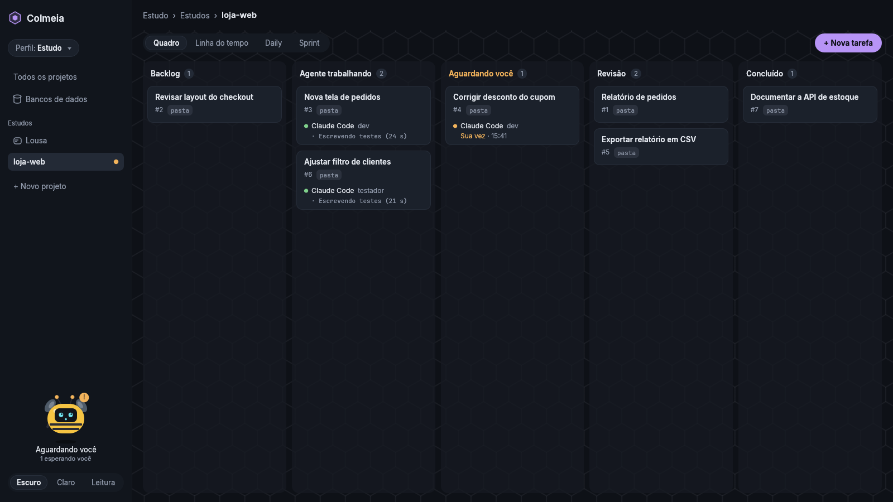
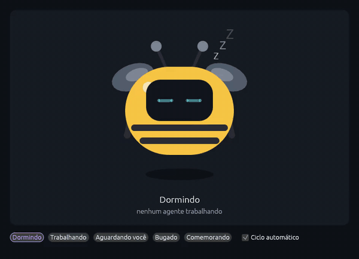
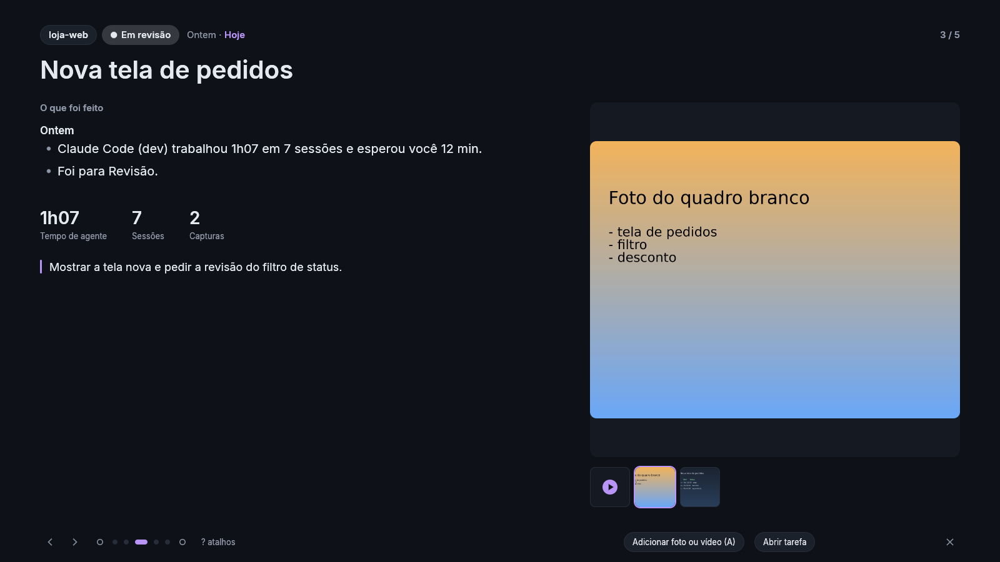
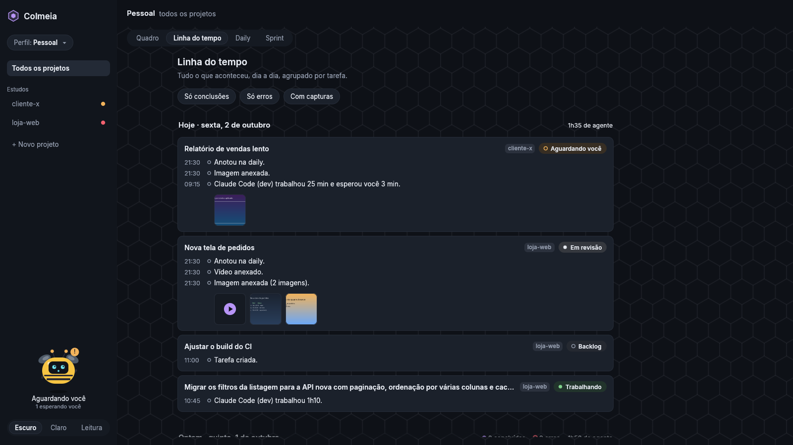
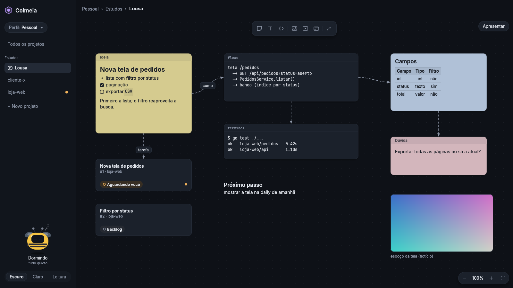
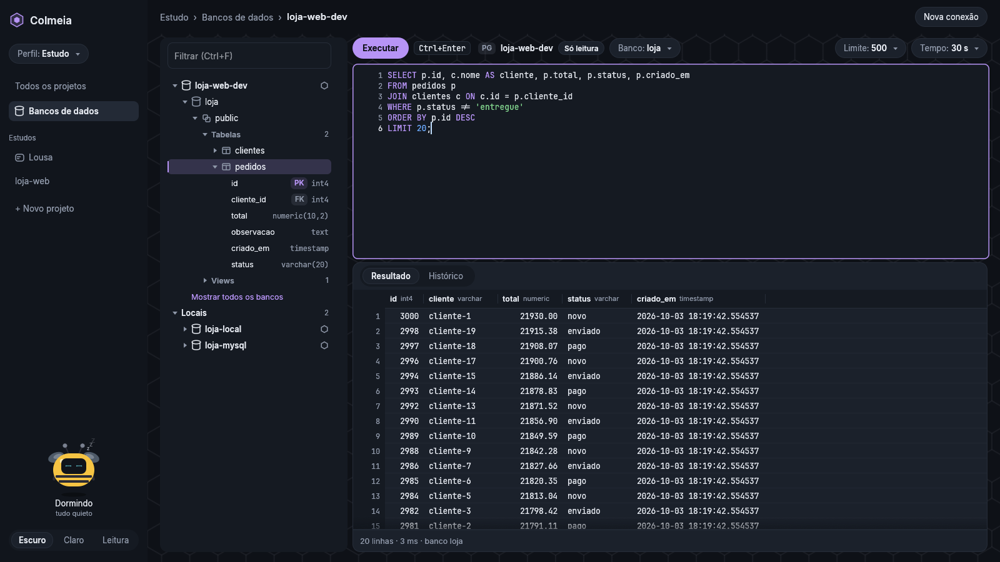

# Colmeia

Colmeia é um app desktop para coordenar vários agentes de IA de código trabalhando ao mesmo tempo.

Com um agente escrevendo testes, outro ajustando uma tela e outro investigando um bug, o trabalho passa a depender de quem acompanha todos eles. São muitos terminais abertos, contexto copiado de um lado para o outro e pouca visibilidade sobre qual agente está esperando uma resposta. A Colmeia reúne isso num só lugar. Cada projeto tem um quadro de tarefas, cada tarefa tem os seus agentes (Claude Code, Codex, Gemini CLI, OpenCode) com o terminal integrado, e uma abelha no canto da tela avisa quando algum deles precisa de você. O que acontece ao longo do dia fica registrado e pronto para a daily e para a sprint.



Roda no Linux e no Windows e é de código aberto.



## Instalação

Cada versão publicada tem os binários para Linux e Windows (x86_64) na página de releases, com o `SHA256SUMS` ao lado.

No Linux:

```bash
sha256sum -c SHA256SUMS
mkdir colmeia && tar -xzf colmeia-linux-x86_64.tar.gz -C colmeia
./colmeia/instalar.sh   # instala em ~/.local/bin, com atalho e ícone, sem sudo
```

No Windows 10 (1803 ou mais novo) ou 11, extraia o `colmeia-windows-x86_64.zip` e rode, no PowerShell, de dentro da pasta extraída:

```powershell
powershell -ExecutionPolicy Bypass -File .\instalar.ps1   # instala em %LOCALAPPDATA%\Programs\Colmeia, com atalho no menu Iniciar
```

Se preferir compilar, os passos estão em [Desenvolvimento](#desenvolvimento).

A Colmeia tem duas partes. A janela é apenas a interface. Quem cuida dos terminais é o núcleo, um processo em segundo plano que a janela inicia sozinha. Por isso, fechar a janela não interrompe os agentes, que continuam trabalhando (e consumindo a sua conta de IA). Se houver agente rodando, a Colmeia pergunta se é para fechar só a janela ou parar tudo. Para encerrar o núcleo de vez, use `colmeia-nucleo --encerrar`.

Os dados ficam em `~/.local/share/colmeia/` no Linux e em `%LOCALAPPDATA%\Colmeia\dados` no Windows, acessíveis apenas pelo seu usuário.

## Primeiros passos

Na primeira execução, a Colmeia pede a criação de um perfil. Perfis separam contextos, como trabalho e estudo, cada um com os seus projetos, contas de IA e tema (escuro, claro ou leitura). A Colmeia detecta as ferramentas de IA instaladas, e cada uma pode usar a conta do sistema ou uma conta exclusiva do perfil.

Em seguida, adicione um projeto. Pode ser um repositório git ou qualquer pasta, que não é alterada ao ser adicionada.

Para falar com um agente, crie uma tarefa em "+ Nova tarefa", abra a tarefa e clique em **Adicionar agente**. O terminal do Claude Code abre dentro da tarefa. É possível digitar diretamente nele ou usar a caixa de mensagem embaixo, que envia com Enter (Shift+Enter quebra a linha), aceita imagens coladas e lembra das mensagens anteriores com a seta para cima.

Os cartões podem ser arrastados entre colunas, e o botão direito (ou o "⋯") mostra as demais ações.

Na barra lateral, os projetos ficam agrupados por workspace. Clicar no nome do workspace mostra todos os projetos dele juntos, e a seta ao lado recolhe o grupo. Um workspace recolhido continua sinalizando, com um ponto colorido, quando algum agente dele precisa de você.

## O que dá para fazer

### Quadro e agentes

Numa tarefa de repositório git, o agente pode trabalhar direto na pasta do projeto ou numa cópia isolada, um git worktree na branch da tarefa. Assim, dois agentes não interferem no trabalho um do outro.

Uma tarefa pode ter vários agentes. O que está em foco aparece em tempo real e os outros viram miniaturas. Se você começou uma conversa com o Claude Code no IntelliJ ou num terminal, **Retomar conversa** lista as que ele guardou para aquela pasta e retoma de onde parou.

O cartão mostra o que cada agente está fazendo, com a mesma cor e o mesmo texto no quadro, no painel e na abelha.

| Estado | Como aparece |
| --- | --- |
| Trabalhando | ponto verde e a última linha do terminal |
| Pede aprovação | "Parece pedir aprovação · desde 14:32" |
| Sua vez | "Sua vez · desde 14:32" |
| Quer consultar o banco | um pedido esperando a sua aprovação |
| Parado | "Parado desde 14:10" |
| Terminou ou deu erro | "Terminou às 14:40", "Parou com erro (código 1) às 14:40" |

O estado "Sua vez" é uma estimativa. Depois de alguns segundos sem saída, a Colmeia considera que o agente terminou e aguarda você, por isso a tela usa "parece" ([decisão 0005](docs/decisoes/0005-estado-do-agente-por-heuristica.md)). O cartão se move automaticamente entre "Agente trabalhando" e "Aguardando você", mas nunca vai para Revisão ou Concluído sem você mandar.

Quando algo precisa de você em outra tarefa, aparece um aviso no rodapé. Com a janela em segundo plano, o título vira "Colmeia · 2 esperando você". Ctrl+Shift+P leva direto ao próximo agente que está esperando.

### Linha do tempo, daily e sprint



Tudo o que acontece nas tarefas vira um registro. A **linha do tempo** mostra um dia por vez, com um cartão por tarefa e as capturas em miniatura. A **daily** junta o que mudou desde o último dia com atividade, separado em concluídas, em revisão, esperando você, trabalhando e com erro, e "Copiar texto" entrega o resumo pronto para falar. Uma tarefa já apresentada sai da daily de hoje pelo menu do cartão ("Tirar desta daily") ou pelo H na apresentação, e continua na sprint. A **sprint** cobre 7 ou 14 dias, o mês ou as datas que você escolher, e exporta em Markdown com as capturas. As três funcionam por projeto, por workspace ou para o perfil inteiro, sempre separadas por projeto.

O tempo que cada agente trabalhou e esperou fica oculto por padrão, inclusive no texto copiado e na exportação. A opção "Mostrar tempo dos agentes", guardada por perfil, exibe esses números quando necessário ([decisão 0010](docs/decisoes/0010-tempo-dos-agentes-opcional.md)).

O **modo apresentação** (F5) foi feito para a reunião. Ele exibe a daily ou a sprint em tela cheia, com uma capa e um slide por tarefa. Cada slide destaca a sua nota, escrita com N em markdown, que funciona como roteiro da fala. A lista do que foi feito fica recolhida e abre com um clique. O slide também aceita fotos e vídeos com A ou arrastando o arquivo para a janela. Fotos JPEG perdem o EXIF no caminho. Enquanto você apresenta, nenhum aviso aparece na tela.



### Pedir ao agente, navegador e arquivos

Da daily, da sprint ou do slide (P), é possível fazer um pedido ao agente de uma tarefa sem abrir o terminal, como "traga o total de testes e complemente a nota" ou "capture prints das telas prontas". O pedido aguarda o agente concluir o que está fazendo, e a resposta é incorporada à nota.

Todo Claude Code iniciado pela Colmeia recebe ferramentas próprias via MCP, restritas à sua tarefa. Com elas o agente lê a tarefa e a nota, complementa a nota, anexa imagens, usa o navegador da tarefa, escreve na lousa e pede consultas ao banco. Codex, Gemini e OpenCode ainda não recebem essas ferramentas.

O **navegador da tarefa** é um Chrome com perfil próprio, separado do seu, que abre ao lado da janela e pode ser capturado com Ctrl+Shift+B. A gaveta de **arquivos** (Ctrl+Shift+E) mostra a pasta da tarefa em modo somente leitura, com pré-visualização de texto e imagem, e pede confirmação antes de mostrar `.env` e chaves.

### Rodar o projeto (Play)

Como no IntelliJ, cada projeto tem **configurações de execução**: um comando do shell, a pasta onde ele roda e as variáveis de ambiente. A Colmeia traz as configurações do IntelliJ (Go, Go test, Flutter, npm e Shell, de `.idea/workspace.xml` e `.run/`) e sugere as do `package.json`, do `Makefile`, do Cargo e do Go. O botão **Rodar** fica no quadro do projeto e no topo da tarefa (lá, roda na pasta da tarefa); a saída aparece num painel embaixo, com Parar e Rodar de novo, e quem roda é o núcleo: fechar a janela não para o programa. Shift+F10 roda e Ctrl+F2 para.

### Lousa



Cada workspace tem uma lousa, e cada tarefa também (Ctrl+Shift+Q). É um quadro livre para notas em markdown, trechos de código, imagens, vídeos e cartões de tarefa ao vivo, ligados por setas.

Clique duplo no vazio cria uma nota, e N, T, C, I e K criam outros itens onde está o mouse. Para ligar dois itens, puxe a bolinha que aparece na borda de um até o outro, ou selecione os dois com Shift e use o botão de ligação. O agente também pode escrever na lousa da tarefa, e o conteúdo novo aparece imediatamente, destacado. Com F5, a lousa vira apresentação, seguindo as setas.

### Banco de dados



Cada perfil guarda as suas conexões de PostgreSQL, MySQL/MariaDB, SQLite e SQL Server (este ainda experimental), em Ctrl+Shift+K. A árvore vai da conexão até as colunas, carregada sob demanda, e o console executa a instrução sob o cursor com Ctrl+Enter.

As senhas ficam no chaveiro do sistema e nunca são gravadas no banco da Colmeia nem nos logs. Sem chaveiro disponível, a senha é solicitada ao conectar e mantida apenas em memória.

Toda conexão começa em modo somente leitura. Para alterar dados é preciso ligar "Permitir alterações", e, ainda assim, cada alteração exige confirmação com a instrução completa na tela. O agente pode pedir consultas de leitura numa conexão em que você liberou isso, que só são executadas após a sua aprovação na tela. A linha do tempo registra que houve consulta, nunca o SQL nem o resultado ([decisão 0009](docs/decisoes/0009-bancos-chaveiro-e-somente-leitura.md)).

## Atalhos

Os atalhos próprios da Colmeia usam **Ctrl+Shift+letra** e não são repassados ao terminal.

| Atalho | Ação |
| --- | --- |
| Ctrl+Shift+P | Próximo agente que precisa de você |
| Ctrl+Shift+L / Ctrl+Shift+D | Linha do tempo / Daily |
| Ctrl+Shift+K | Bancos de dados |
| Ctrl+Shift+S / Ctrl+Shift+B | Captura o terminal / o navegador da tarefa |
| Ctrl+Shift+E / Ctrl+Shift+Q | Arquivos / lousa da tarefa |
| Ctrl+Esc | Volta ao quadro |
| Enter, Shift+Enter ou Ctrl+Enter, ↑ ↓ | Na caixa de mensagem, envia, quebra a linha e navega pelas mensagens anteriores |
| Ctrl+Enter, Esc | No console de banco, executa e cancela |
| F5 / Shift+F5 | Apresenta / retoma do último slide |
| Shift+F10 / Ctrl+F2 | Roda / para a configuração de execução escolhida (Play) |

Na apresentação, as setas, PgUp/PgDn e Espaço passam os slides, N edita a nota, A adiciona foto ou vídeo, P pede ao agente, L alterna entre anexos e lousa, H esconde o slide e ? lista os demais atalhos.

## Por dentro

```
┌─────────────────────────────┐        ┌────────────────────────────┐
│ app/ (Rust + egui)          │        │ nucleo/ (Go)               │
│ a tela: só mostra e pede    │ ─────▶ │ estado, terminais, agentes │
│                             │  /v1   │ eventos e bancos           │
└─────────────────────────────┘        └────────────────────────────┘
        socket Unix (diretório 0700) + token
```

O núcleo, em Go, guarda tudo num SQLite com um histórico de eventos encadeado por hash, cuida dos terminais e valida cada pedido. A tela, em Rust com egui, só mostra e pede. As mudanças chegam por WebSocket, então a tela em repouso não faz consultas nem redesenhos desnecessários, e só o terminal em foco roda em tempo real. O mesmo núcleo serve as ferramentas MCP dos agentes e controla o navegador por pipe.

A Colmeia não abre nenhuma porta de rede. O núcleo escuta num socket Unix dentro de uma pasta acessível apenas ao seu usuário, com um token novo a cada início, e cada agente tem um token que só vale para a tarefa dele. Nada passa por shell, os dados têm permissão restrita ao usuário, e mensagens, notas e itens da lousa que parecem conter senha ou chave não são guardados.

Mais detalhes estão na [arquitetura](docs/arquitetura.md), as [decisões registradas](docs/decisoes/), as [dependências](docs/dependencias.md) e o [modelo de segurança](SECURITY.md).

## Desenvolvimento

Para compilar, são necessários Go 1.26+, Rust 1.88+ e as bibliotecas de sistema do `eframe` (no Ubuntu, `libxkbcommon-dev`, `libgtk-3-dev` e os drivers de vídeo).

```bash
# Núcleo
go -C nucleo build -o ../bin/colmeia-nucleo ./cmd/colmeia-nucleo

# Tela (inicia o núcleo sozinha)
COLMEIA_NUCLEO=$PWD/bin/colmeia-nucleo cargo run --release -p colmeia

# Modo demonstração, com cargas de teste e cenários para a abelha
COLMEIA_DEMO=1 COLMEIA_NUCLEO=$PWD/bin/colmeia-nucleo cargo run --release -p colmeia

# Instalar o que foi compilado
./scripts/instalar.sh
```

Os testes abaixo são os mesmos do CI, que também executa `govulncheck`, `cargo audit` e o gitleaks.

```bash
go -C nucleo test -race ./...
go -C nucleo vet ./... && gofmt -l nucleo
cargo test --workspace
cargo fmt --check && cargo clippy --workspace --all-targets -- -D warnings
```

Os testes de integração com MySQL e PostgreSQL de verdade usam contêineres descartáveis.

```bash
docker run -d --name colmeia-teste-mysql -p 127.0.0.1:33061:3306 -e MYSQL_ROOT_PASSWORD=teste-raiz -e MYSQL_DATABASE=loja mysql:8
docker run -d --name colmeia-teste-pg -p 127.0.0.1:54321:5432 -e POSTGRES_PASSWORD=teste-raiz -e POSTGRES_DB=loja postgres:16-alpine
COLMEIA_TESTE_MYSQL=127.0.0.1:33061 COLMEIA_TESTE_PG=127.0.0.1:54321 go -C nucleo test -tags integracao ./internal/bancos/
docker rm -f colmeia-teste-mysql colmeia-teste-pg
```

Para testar sem afetar os dados reais, aponte `COLMEIA_DIR` e `COLMEIA_DADOS` para pastas de teste, como explica o [CONTRIBUTING.md](CONTRIBUTING.md). O que mudou em cada versão está no [CHANGELOG.md](CHANGELOG.md).

<details>
<summary>Variáveis de ambiente</summary>

| Variável | Para quê |
| --- | --- |
| `COLMEIA_DIR` | Pasta do socket e do token (padrão `$XDG_RUNTIME_DIR/colmeia`) |
| `COLMEIA_DADOS` | Pasta dos dados (padrão `~/.local/share/colmeia`) |
| `COLMEIA_NUCLEO` | Caminho do `colmeia-nucleo`, se ele não estiver ao lado da tela nem no PATH |
| `COLMEIA_DEMO=1` | Inicia o núcleo em modo demonstração |
| `COLMEIA_EDITOR` | Editor usado em "Abrir no…" |
| `COLMEIA_NAVEGADOR` | Chrome ou Chromium do navegador da tarefa |
| `COLMEIA_CHAVEIRO=memoria` | Ignora o chaveiro e guarda as senhas só na memória |
| `COLMEIA_CHAVEIRO_SERVICO` | Nome do serviço no chaveiro (padrão `Colmeia`) |
| `COLMEIA_TEMA` | `escuro`, `claro` ou `leitura`, antes de escolher um perfil |
| `COLMEIA_SEM_ABELHA=1` | Desliga a abelha |
| `COLMEIA_TAMANHO` | Tamanho inicial da janela, como `1280x720` |
| `COLMEIA_FPS=1` | Mostra o contador de quadros, para medir desempenho |

</details>

O código está dividido em `nucleo/` (Go), `app/` (a tela), `mascote/` (a abelha, com uma vitrine em `cargo run --release -p mascote --example vitrine`), `docs/`, `scripts/` e `packaging/`. Em `arquivo/` estão os protótipos avaliados antes da escolha de Rust e egui para a interface.

## Plataformas

O Linux é a plataforma principal. O Windows 10 (1803 ou mais novo) e o 11 são suportados a partir da 0.4.0, com o mesmo canal local, terminais pelo ConPTY e o Chrome ou o Edge como navegador da tarefa ([decisão 0011](docs/decisoes/0011-windows-com-socket-unix.md)); o suporte é recente, e problemas podem ser relatados nas issues. O macOS deve funcionar, mas ainda não foi testado.

## Licença

À sua escolha, [MIT](LICENSE-MIT) ou [Apache 2.0](LICENSE-APACHE). As fontes em `app/fontes/` seguem a SIL Open Font License 1.1.
