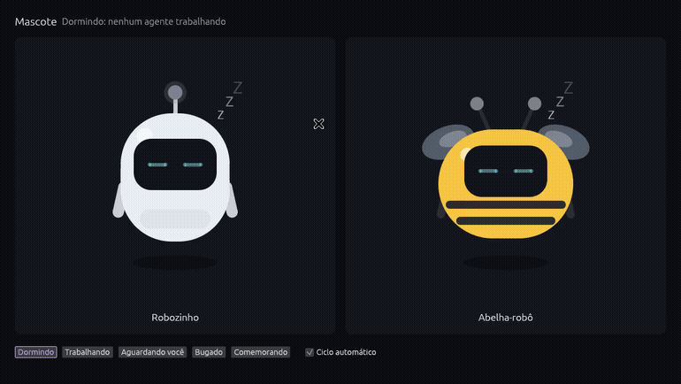

# Colmeia

Um app desktop para coordenar vários agentes de IA de código (Claude Code, Codex e outros) em projetos e branches isolados, com um quadro de tarefas, uma abelha que avisa quando algo precisa de você e o registro do trabalho pronto para a daily e a sprint.



> **Estado atual:** fundação. O quadro de tarefas, o painel da tarefa com terminais e caixa de mensagem, a abelha e o núcleo com canal local seguro funcionam no Linux. Tarefas ainda são de exemplo e não são gravadas; o Windows ainda não roda (veja [Plataformas](#plataformas)).

## Por que existe

Quem trabalha com vários agentes vira o gargalo: copia contexto de um terminal para outro, perde o controle do que cada um está fazendo e mistura ambientes. A Colmeia junta, num lugar só:

- **Isolamento por branch:** cada tarefa trabalha na sua cópia do repositório, com portas e ambiente próprios.
- **Quadro de tarefas por projeto**, estilo Jira, com a branch como filtro e cartões que se movem sozinhos.
- **Terminais dos agentes** no painel da tarefa: o que está em foco em tempo real, os outros como miniaturas.
- **A abelha**, que resume o que mais precisa de você (erro, aprovação pendente, trabalho em andamento) e comemora quando uma tarefa termina.
- **Registro do trabalho** para daily e sprint (planejado).

É um projeto pessoal, de código aberto e gratuito, feito para ajudar colegas e qualquer dev. Não é projeto de nenhuma empresa nem tem vínculo com uma.

## Como rodar (Linux)

Requisitos: Go 1.24+, Rust 1.88+ e as bibliotecas de sistema que o `eframe` usa (no Ubuntu, `libxkbcommon-dev`, `libgtk-3-dev` e os drivers de vídeo).

```bash
# 1. Núcleo
go -C nucleo build -o ../bin/colmeia-nucleo ./cmd/colmeia-nucleo

# 2. Tela (inicia o núcleo sozinha se ele não estiver rodando)
COLMEIA_NUCLEO=$PWD/bin/colmeia-nucleo cargo run --release -p colmeia

# Modo demonstração: cargas de teste nos terminais e cenários para a abelha
COLMEIA_DEMO=1 COLMEIA_NUCLEO=$PWD/bin/colmeia-nucleo cargo run --release -p colmeia

# Vitrine do mascote
cargo run --release -p mascote --example vitrine
```

O núcleo continua rodando depois que a tela fecha, porque é dono dos terminais. Para encerrá-lo: `pkill colmeia-nucleo`.

Variáveis úteis da tela: `COLMEIA_TEMA` (`claro`, `escuro`, `sistema`), `COLMEIA_TAREFA=101` (abre direto no painel de uma tarefa), `COLMEIA_CARTOES=500`, `COLMEIA_CENARIO=erro` e `COLMEIA_SEM_ABELHA=1`.

## Arquitetura

```
┌─────────────────────────────┐        ┌────────────────────────────┐
│ app/ (Rust + egui)          │        │ nucleo/ (Go)               │
│ quadro, painel, abelha      │ ─────▶ │ dono dos terminais         │
│ nenhuma regra de negócio    │  /v1   │ controle de fluxo, ritmo   │
└─────────────────────────────┘        │ por terminal, histórico    │
        canal local: socket Unix       └────────────────────────────┘
        (diretório 0700) + token
```

- **Núcleo separado da tela.** A tela só mostra e pede; o núcleo guarda o estado. Um cliente futuro (o celular) fala o mesmo protocolo.
- **Protocolo versionado** desde o primeiro dia: tudo fica sob `/v1`.
- **Só o terminal em foco é tempo real.** Cada conexão pede o seu ritmo (16 ms, 250 ms, 1 s), o que corta o processador de 3 a 5 vezes.
- **Controle de fluxo.** A tela confirma o que desenhou; se ficar para trás, o núcleo para de ler o terminal e o programa que escreve espera.

Mais detalhes em [docs/arquitetura.md](docs/arquitetura.md) e nas [decisões registradas](docs/decisoes/).

## Segurança

O núcleo **não abre nenhuma porta de rede**. Ele escuta num socket Unix dentro de um diretório só do usuário, e toda conexão precisa de um token que é gerado a cada início. As cargas de teste, que escrevem comandos nos terminais, só existem com `--demo`. O modelo completo está em [SECURITY.md](SECURITY.md).

## Estrutura

| Pasta | O que tem |
| --- | --- |
| `nucleo/` | Núcleo em Go: canal local, API `/v1`, terminais, cargas de demonstração |
| `app/` | Tela em Rust + egui, com as fontes Inter e JetBrains Mono embutidas (licença OFL) |
| `mascote/` | A abelha-robô, como biblioteca, e a vitrine em `examples/` |
| `docs/` | Arquitetura e decisões |
| `scripts/` | `medir.sh`, para medir processador e memória |
| `arquivo/` | Os protótipos React + Tauri e Flutter comparados na escolha da tela |

## Testes

```bash
go -C nucleo test -race ./...
cargo test --workspace
```

## Plataformas

| | Linux | macOS | Windows |
| --- | --- | --- | --- |
| Núcleo | sim | deve funcionar (não testado) | falta o canal por named pipe e os terminais por ConPTY |
| Tela | sim | deve funcionar (não testado) | compila; falta o canal |

## Licença

Licença dupla, à sua escolha: [MIT](LICENSE-MIT) ou [Apache 2.0](LICENSE-APACHE). As fontes em `app/fontes/` seguem a SIL Open Font License 1.1.
